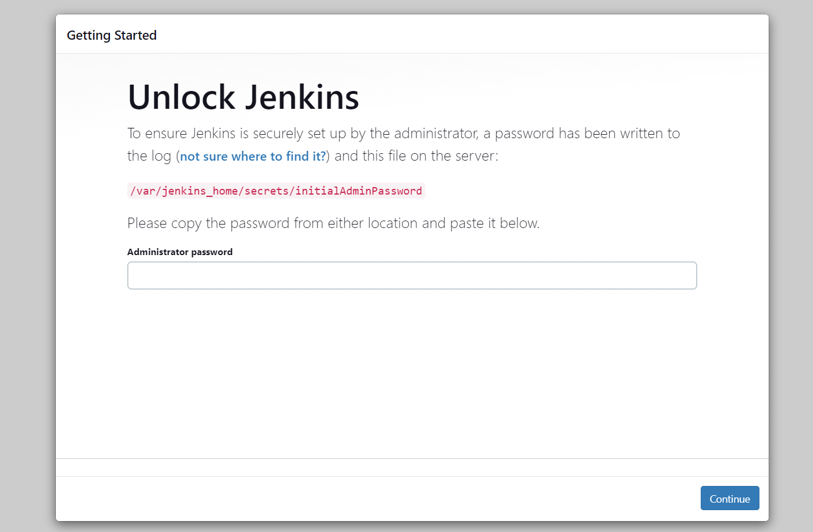
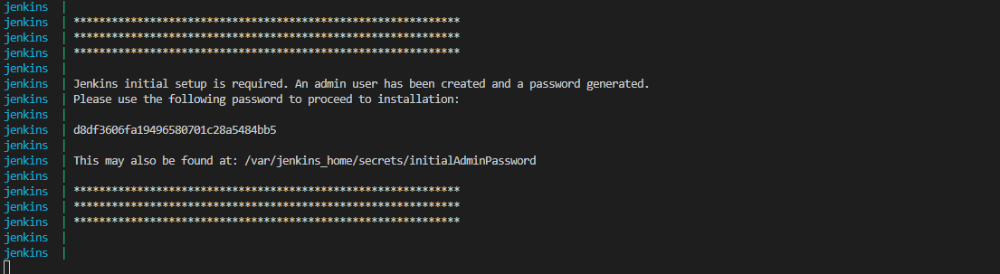
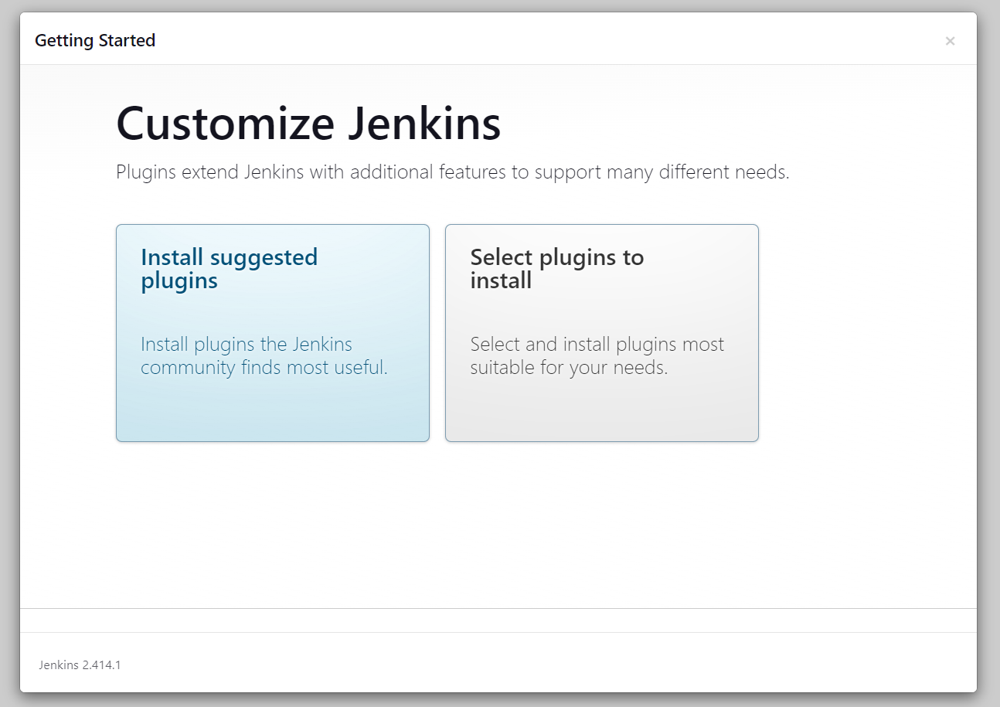
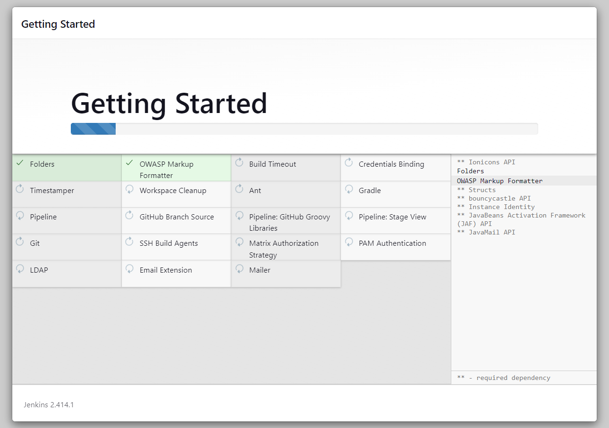
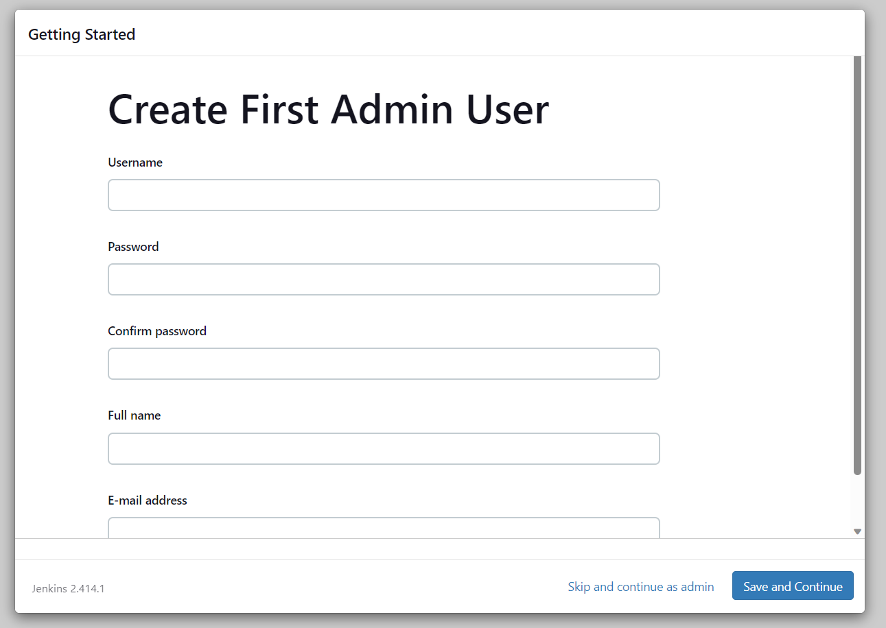
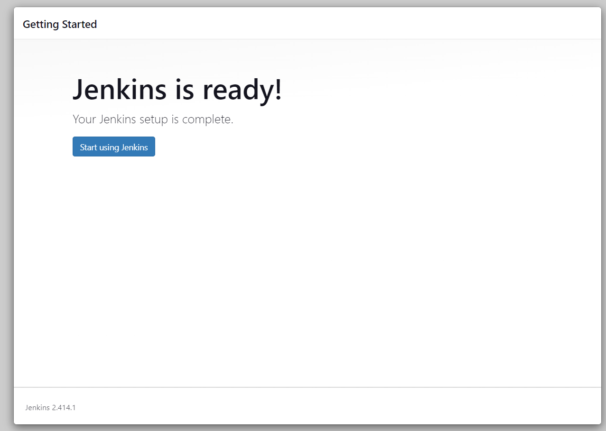

<h1 align="center">Jenkins Docker Template</h1>


<h3 align="center">a brief setup of jenkins to get you up and running</h3>


### Overview
- [Setup](#setup)
- [License](#license)
- [Bugs or Opinion](#bugs-or-opinion)


# Setup
for start all you have to do to install jenkins on your pc and running it, is to build the image through the docker-compose:

```shell
docker-compose up --build
```
after everything is done and setup us completed you can open the web portal by going to <http://127.0.0.1:8080> and you will face the page blow which asks you for the token.

<div align="center" ></div>

token as already been made but you can have it first by watching the terminal as the jenkins is getting ready and also in a specific directory that is being shown in the web page.

<div align="center" ></div>

after copy and pasting the token you will be going to need to choose the plugins you are going to be using. you can choose the custom mode or choosing the default mode.

<div align="center" ></div>

<div align="center" ></div>

next when everything is done you will be asked to fill a form which will asks for the admin setup, username, password and etc.

<div align="center" ></div>
<div align="center" ></div>


finally you will be redirected to the main page of jenkins.

<div align="center" ></div>


# License
MIT

# Bugs or Opinion
Feel free to let me know if there are any problems or any request you have for this repo.
